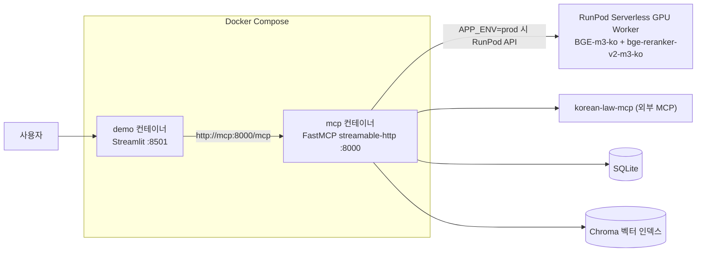
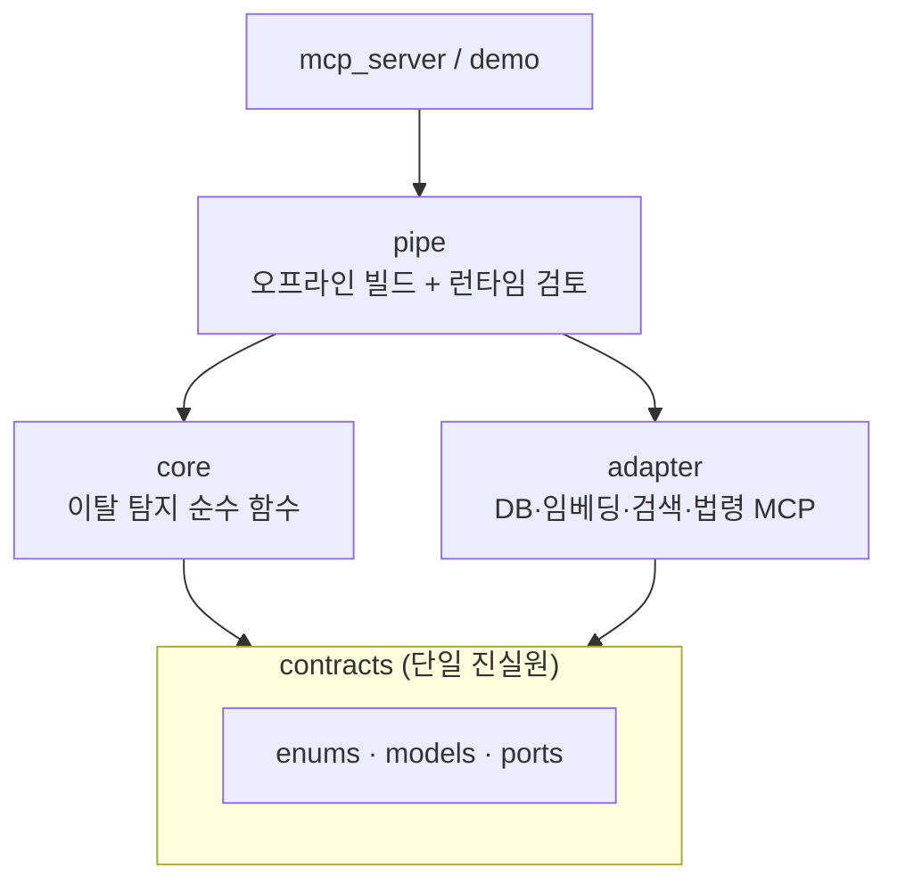
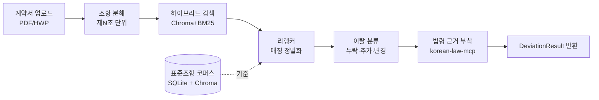

# WorkShield 🛡️

> **프리랜서 용역계약서를 표준계약서와 조항 단위로 비교해 "표준 대비 이탈"을 탐지하는 RAG MCP 시스템**

내가 받은 계약서가 정부·공공기관 **표준계약서** 대비 **어디가 빠졌고(누락) / 더 들어갔고(추가) / 다르게 쓰였는지(변경)** 를 찾아주고, 관련 **법령 조문**까지 근거로 붙여줍니다.

---

## 목차

1. [프로젝트 개요](#1-프로젝트-개요)
2. [기술 스택 & 시스템 아키텍처](#2-기술-스택--시스템-아키텍처)
3. [시작하기](#3-시작하기)
4. [MCP 서버 연동 가이드](#4-mcp-서버-연동-가이드)
5. [MCP 도구 및 리소스 명세](#5-mcp-도구-및-리소스-명세)
6. [개발 및 유지보수 명령어 레퍼런스](#6-개발-및-유지보수-명령어-레퍼런스)
7. [프로젝트 폴더 구조](#7-프로젝트-폴더-구조)
8. [개발 시 절대 규칙](#8-개발-시-절대-규칙)
9. [라이선스 / 출처](#9-라이선스--출처)

---

## 1. 프로젝트 개요

### WorkShield 소개
정부·공공기관이 배포한 **표준계약서**를 정답(기준)으로 고정하고, 사용자가 실제로 받은 프리랜서 용역계약서를 조항 단위로 비교해 표준 대비 이탈(누락/추가/변경)을 찾아내는 RAG(검색 증강) 기반 MCP 시스템입니다. 이탈이 발견된 조항에는 관련 법령 조문을 근거로 함께 붙여줍니다.

### 핵심 개발 철학

**"올바른 법 해석을 생성"하지 않는다. "표준 대비 이탈을 탐지"한다.**

법 해석을 AI가 지어내면 정답 기준이 무너지고 책임 문제가 생깁니다. 그래서 **표준계약서를 정답(기준)으로 고정**하고, 사용자 조항이 그 기준에서 벗어난 지점을 검색으로 찾습니다. "벗어남"은 검증·측정이 가능한 문제입니다.

- **1차 MVP (현재):** LLM 없이 **검색·비교·규칙**만으로 이탈 탐지 → MCP 도구로 제공. LLM 없이 정량 평가(Recall@k·MRR·ablation).
- **2차 (예정):** 1차 MCP를 LLM에 붙인 웹앱 — "불리함" 해석·협상 초안 생성.
- **결정론적 판정:** 같은 입력엔 항상 같은 출력. 매칭 없음은 빈 응답이 아니라 `Deviation.NO_MATCH` 같은 명시 표식으로 반환합니다.
- **"검토 후보" 프레이밍:** 모든 도구의 출력은 "이탈 검토 후보"이며, "위법/합법", "소송에서 이긴다" 같은 단정적 결론을 만들지 않습니다.

> 자세한 기획은 [docs/01.mvp_기획.md](docs/01.mvp_기획.md), 시스템 구성은 [docs/시스템 아키텍처.md](docs/시스템%20아키텍처.md) 참고.

### 팀원

<table>
  <tr align="center">
    <td></td>
    <td></td>
    <td></td>
    <td></td>
    <td></td>
  </tr>
  <tr align="center">
    <td><b>박세빈</b></td>
    <td><b>홍철민</b></td>
    <td><b>김효선</b></td>
    <td><b>장규원</b></td>
    <td><b>박지유</b></td>
  </tr>
  <tr align="center" valign="top">
    <td>데이터 임베딩 처리,<br>독소 조항 수집 및 정의</td>
    <td>시스템 설계 및<br>mcp 구현</td>
    <td>eval 평가 및<br>테스트 계획 수립</td>
    <td>데이터 전처리 및<br>조항 카테고리 라벨링</td>
    <td>검색 파이프라인 구현</td>
  </tr>
</table>

---

## 2. 기술 스택 & 시스템 아키텍처

### 기술 스택

| 영역 | 사용 도구 |
| --- | --- |
| 임베딩 / 리랭커 | `dragonkue/BGE-m3-ko` · `dragonkue/bge-reranker-v2-m3-ko` |
| 벡터 검색 | Chroma (dense) + `rank_bm25` + Kiwi 형태소 (sparse) + RRF 융합 |
| 조항 분해(청킹) | LlamaIndex `MarkdownNodeParser` |
| 저장소 | SQLite (조항·관계·독소패턴) |
| 법령 근거 | korean-law-mcp (외부 MCP) |
| 문서 변환 | kordoc (HWP 3.x/5.x, HWPX, HWPML, PDF, XLS, XLSX, DOCX → 마크다운) |
| 인터페이스 | MCP (`mcp[cli]` / FastMCP) |
| 검증 · 도구 | pydantic · uv · just · pytest |

### 서비스 토폴로지

로컬/운영 모두 **MCP 서버(`mcp`)와 데모 웹(`demo`)이 별개 컨테이너**로 뜨고, 무거운 임베딩/리랭킹 연산만 RunPod 서버리스 GPU 워커로 분리됩니다 ([docker-compose.yml](docker-compose.yml)).



### 헥사고날(포트-어댑터) 구조

**코어는 외부를 모른다.** 동결된 계약(`contracts`)에만 의존해 여러 명이 병렬로 개발합니다.



### 런타임 검토 흐름 (`review_contract`)



> 모듈별 상세는 각 폴더 README: [contracts](src/contracts/README.md) · [core](src/core/README.md) · [adapter](src/adapter/README.md) · [pipe](src/pipe/README.md), 전체 아키텍처는 [docs/시스템 아키텍처.md](docs/시스템%20아키텍처.md).

---

## 3. 시작하기

### 사전 준비물
- [uv](https://docs.astral.sh/uv/) (Python 패키지 매니저), Python 3.13
- Node.js (없으면 `just setup`이 자동 설치 시도)
- 법제처 API 인증키 `OPEN_LAW_API_KEY` ([open.law.go.kr](https://open.law.go.kr) 발급) — `just setup` 중 입력 안내

### 설치 & 빌드
```bash
uv tool install rust-just     # just 명령 러너 설치 (최초 1회)
just setup                    # node·MCP패키지·uv동기화·모델다운로드·DB마이그레이션 일괄
just build-db                 # 03_normalized(정답) → SQLite → Chroma 인덱스 재생성
```

### 로컬 실행 확인
```bash
just run-mcp                  # MCP 서버를 stdio 트랜스포트로 로컬 기동 (PYTHONPATH=src, src/app.py)
just run-mcp-ui                # MCP Inspector 웹 UI로 도구 호출 테스트 (.env 자동 바인딩)
```

---

## 4. MCP 서버 연동 가이드

WorkShield MCP 서버의 진입점은 [src/app.py](src/app.py)이며, `MCP_TRANSPORT` 환경변수로 트랜스포트를 전환합니다(기본 `stdio`, 컨테이너 배포는 `streamable-http`).

### 환경 변수 (`.env`)
루트 `.env`에 다음 값을 설정합니다 (`src/config.py` 기준).

| 변수 | 용도 | 비고 |
| --- | --- | --- |
| `OPEN_LAW_API_KEY` | 법제처 Open API 인증키 | `just setup` 중 입력 안내, `korean-law-mcp` 연동에 사용 |
| `APP_ENV` | `local` \| `prod` | `local`이면 임베더/리랭커를 로컬 모델로 직접 로딩, 그 외엔 RunPod API 사용 |
| `RUNPOD_API_KEY` / `RUNPOD_ENDPOINT_ID` | 운영(prod) 임베딩/리랭킹 | `just deploy-embedding`으로 최초 발급 후 `.env`에 자동 반영 |
| `DB_BASE_FILE` | SQLite 경로 | 기본 `data/migration/contract.sqlite3` |
| `EMBEDDING_MODEL_NAME` / `RERANKER_MODEL_NAME` | 모델명 오버라이드 | 기본 `dragonkue/BGE-m3-ko` / `dragonkue/bge-reranker-v2-m3-ko` |

데모(Streamlit) 쪽은 `demo/.env`에 `LLM_PROVIDER`, `GEMINI_API_KEY`, `GEMINI_MODEL`, `WORKSHIELD_MCP_URL`을 별도로 설정합니다.

### Stdio 클라이언트 연동 (Cursor / Claude Desktop 등)
로컬 stdio 트랜스포트는 클라이언트가 프로세스를 직접 실행하는 방식이라, MCP 설정 파일에 `uv run` 커맨드를 등록하면 됩니다. Cursor는 `.cursor/mcp.json`, Claude Desktop은 `claude_desktop_config.json`에 동일한 형태로 등록합니다.

```json
{
  "mcpServers": {
    "workshield": {
      "command": "uv",
      "args": ["run", "python", "src/app.py"],
      "cwd": "/absolute/path/to/SKN30-3rd-2Team",
      "env": {
        "PYTHONPATH": "src"
      }
    }
  }
}
```

`cwd`는 이 저장소의 절대 경로로 바꿔야 하며, `.env`가 저장소 루트에 있어야 `OPEN_LAW_API_KEY` 등이 로드됩니다.

### 네트워크(streamable-http) / Docker 연동
컨테이너 또는 원격 배포 환경에서는 `streamable-http` 트랜스포트로 띄우고 URL로 접속합니다.

```bash
just docker-run    # 로컬 Docker 포그라운드 실행 (APP_ENV=prod, 8000 포트, --env-file .env)
# 또는
docker compose up  # mcp(:8000) + demo(:8501) 동시 기동
```

클라이언트에서는 `http://<host>:8000/mcp`를 MCP 엔드포인트로 지정합니다(`docker-compose.yml`의 `demo` 서비스가 `WORKSHIELD_MCP_URL=http://mcp:8000/mcp`로 접속하는 것과 동일한 방식). `streamable-http`는 클라이언트-서버가 파일시스템을 공유하지 않으므로, 계약서 파일은 로컬 `file_path` 대신 `file_content`(base64)+`file_name`으로 전달해야 합니다.

---

## 5. MCP 도구 및 리소스 명세

[src/server/server.py](src/server/server.py)가 노출하는 전체 표면입니다. 모든 도구의 응답은 "이탈 검토 후보"이며 법적 결론을 단정하지 않습니다.

| 도구 / 리소스 | 역할 | 이탈 판정 |
| --- | --- | --- |
| `parse_contract` | 계약서(HWP/PDF) → 조항(`Clause[]`) 분해 | 없음 |
| `match_clause` | 단일 조항 텍스트 → 유사 표준조항 후보 나열 (검색 전용) | 없음 |
| `classify_clause` | 단일 조항 → 재정렬·매칭·판정 (부분 검토용) | `EXTRA`/`CHANGED`/`NONE`/`NO_MATCH` (`MISSING` 불가) |
| `review_contract` | 계약서 전체 → 파싱→매칭→분류→법령근거 (`async`, 진행률 보고) | 전체 (`MISSING` 포함) |
| `get_grounding` | 카테고리 또는 조항 텍스트 → 관련 법령 조문 조회 | 없음 (근거 조회) |
| `list_contract_types` | 지원 계약 종류(`ContractType`) 목록 조회 | 없음 |
| `list_categories` | 조항 분류 카테고리(`Category`) + 설명/앵커 키워드 조회 | 없음 |
| `list_toxic_patterns` / `list_toxic_pattern_details` | 독소조항 패턴(`ToxicPattern`) 목록 / 상세 조회 | 없음 |
| `standard://{contract_type}` (resource) | 계약 유형별 표준조항 요약 브라우징 | 없음 |
| `standard://{contract_type}/{clause_id}` (resource) | 표준조항 원문 전체 조회 | 없음 |

전체 계약서를 다 돌리지 않고 조항 하나만 볼 때는 `match_clause`(후보 나열) 또는 `classify_clause`(판정까지)를 쓰는 편이 `review_contract`보다 빠릅니다. `contract_type`/`category` 등 enum 인자값은 하드코딩하지 말고 `list_contract_types`/`list_categories`로 런타임에 조회하세요(값 집합이 버전에 따라 바뀔 수 있음).

---

## 6. 개발 및 유지보수 명령어 레퍼런스

| 명령 | 설명 |
| --- | --- |
| `just setup` | 최초 1회: node·MCP·uv·모델 다운로드 |
| `just install-runpod` | Runpod CLI 설치 및 상태 점검 (OS 자동 판별) |
| `just build-db` | [통합] normalize → SQLite → Chroma 인덱스 재생성 |
| `just migrate` | SQLite 마이그레이션까지만 실행 |
| `just build-index` | SQLite → bge-m3 임베딩 → Chroma 인덱스 빌드만 실행 |
| `just test` | 단위 테스트 실행 (integration 제외) |
| `just test [type]` | 테스트 유형 선택 실행 (unit, integration, all) |
| `just eval [t] [v] [e]` | 평가 드라이버 실행 (t: a/b, v: 골든버전, e: local/prod) |
| `just run-mcp [t] [p]` | MCP 서버 로컬 실행 (t: stdio/sse/streamable-http, p: 포트, 기본 stdio/8000) |
| `just run-mcp-ui` | MCP Inspector 웹 테스트 UI 실행 (.env 바인딩) |
| `just deploy-embedding` | [최초 1회] Runpod 템플릿/서버리스 생성 및 .env 갱신 |
| `just embed-on` | Runpod 서버리스 워커 웜업 (min_workers=1) |
| `just embed-off` | Runpod 서버리스 워커 과금 차단 (min_workers=0) |
| `just docker-build` | Docker 이미지 빌드 |
| `just docker-run` | 로컬 Docker 포그라운드 실행 (streamable-http 8000포트 서빙) |
| `just docker-up` | 로컬 Docker 백그라운드(detached) 실행 |

---

## 7. 프로젝트 폴더 구조

```
.
├── data/
│   ├── 01_raw/          # 원본 표준계약서 (HWP)            [커밋]
│   ├── 02_converted/    # 마크다운 변환 (체크포인트)        [커밋]
│   ├── 03_normalized/   # 정규화 조항 JSON = 정답           [커밋]
│   └── migration/       # 스키마 SQL[커밋] + SQLite·Chroma[생성물·미커밋]
├── src/
│   ├── contracts/       # 동결 계약 (enums · models · ports)
│   ├── core/            # 이탈 탐지 순수 함수 (TDD 대상)
│   ├── adapter/         # 외부 I/O (db · vector · embedder · 법령·문서 MCP)
│   ├── pipe/            # 파이프라인 (오프라인 빌드 + 런타임 review)
│   ├── server/          # FastMCP 서버 (도구/리소스 정의, dto)
│   ├── eval/            # 평가 하니스 (metrics · run_eval · ablation)
│   ├── app.py           # MCP 서버 진입점
│   └── config.py
├── demo/                 # Streamlit 데모 웹 (별도 컨테이너)
├── deploy/runpod_worker/ # RunPod 서버리스 워커 이미지/핸들러
├── tests/                # pytest (TDD 규격서)
├── docs/                 # 기획서 + 시스템 아키텍처 + 작업 분배 카드(tasks/)
├── AGENTS.md              # AI·개발자 공용 가이드 (절대 규칙)
├── docker-compose.yml     # mcp + demo 컨테이너 번들
└── justfile               # 명령 모음
```

---

## 8. 개발 시 절대 규칙

1. **1차 코드에 LLM 호출 금지** — 검색·매칭·분류만 (해석은 2차).
2. **동결 계약이 단일 진실원** — 스키마·MCP 시그니처 변경은 사전 합의.
3. 사용자 표면 문구는 **"검토 후보"** 프레이밍 ("위법/합법" 단정 금지).
4. **빈 응답 금지** — 매칭 없음은 `NO_MATCH` 등 명시 표식.
5. **평가에 LLM-judge 금지** — 결정론적·재현 가능한 계산만.

자세한 배경과 아키텍처 규칙은 [AGENTS.md](AGENTS.md) 참고.

---

## 9. 라이선스 / 출처
- 표준계약서: 소프트웨어산업협회(sw.or.kr) · 문화체육관광부(mcst.go.kr)
- korean-law-mcp · kordoc (MIT) / bge 모델 (BAAI) / Chroma (Apache-2.0)
