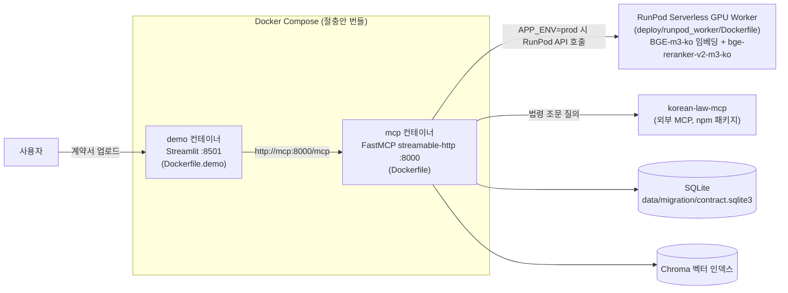
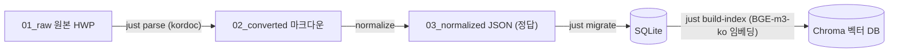
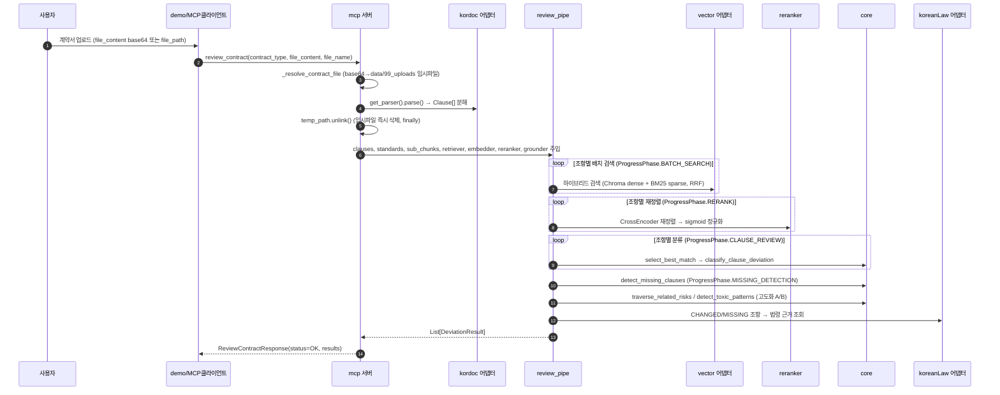

# WorkShield 시스템 아키텍처

> 관련 문서: [01.mvp_기획.md](01.mvp_기획.md) · [AGENTS.md](../AGENTS.md) · 폴더별 `README.md`(`src/contracts`, `src/core`, `src/adapter`, `src/pipe`, `data`)

## 1. 시스템 개요

WorkShield는 프리랜서 용역계약서를 표준계약서와 **조항 단위로 비교**해 이탈(누락/추가/변경)을 탐지하는 RAG 기반 MCP(Model Context Protocol) 서버다.

- **1차 범위는 LLM 호출 없이** 검색(하이브리드 벡터+BM25) · 재정렬(CrossEncoder) · 규칙 기반 분류만으로 동작한다 (`AGENTS.md` 절대 규칙 #1).
- 판정은 항상 결정론적이며, 매칭 실패는 빈 응답이 아니라 `Deviation.NO_MATCH` 등 명시적 표식으로 반환한다 (규칙 #4).
- 결과는 법적 결론이 아닌 **"검토 후보"**로 프레이밍한다 (규칙 #3).

## 2. 서비스 토폴로지

[docker-compose.yml](../docker-compose.yml) 기준 운영 구성은 3개의 실행 단위로 나뉜다 — 로컬에서 함께 뜨는 두 컨테이너(`mcp`, `demo`)와, 무거운 ML 연산만 분리해 외부에 두는 RunPod 서버리스 워커.



| 컨테이너/서비스 | 이미지 | 역할 | 포트 / 프로토콜 |
| --- | --- | --- | --- |
| `mcp` | `workshield-mcp` ([Dockerfile](../Dockerfile)) | [src/app.py](../src/app.py)로 기동되는 FastMCP 서버. 계약서 파싱·매칭·분류·법령근거 도구 제공 | `streamable-http`, `8000` |
| `demo` | `workshield-demo` ([Dockerfile.demo](../Dockerfile.demo)) | Streamlit 데모 UI. `WORKSHIELD_MCP_URL=http://mcp:8000/mcp`로 MCP 도구 호출 | HTTP, `8501` |
| RunPod Serverless Worker | 자체 이미지 ([deploy/runpod_worker/Dockerfile](../deploy/runpod_worker/Dockerfile)) | `sentence-transformers` 기반 임베딩(`BGE-m3-ko`)·리랭커(`bge-reranker-v2-m3-ko`) 연산 전담 | RunPod API (`RUNPOD_ENDPOINT_ID`) |

### 왜 `demo`가 별도 컨테이너인가
`mcp` 이미지는 `chromadb`·`kordoc`·`korean-law-mcp` 등 무거운 의존성을 담고 있는 반면, `demo`는 `streamlit`·`mcp[cli]`·`httpx`만 필요하다. 두 컨테이너를 분리해 데모 쪽 이미지를 가볍게 유지하되, `docker-compose.yml`의 주석("절충안 번들")대로 **논리상 독립 제품(2-프로세스), 운영상 한 번에 기동(1-deploy)** 원칙을 지킨다.

### 로컬(`local`) vs 운영(`prod`) 임베딩 전환
[src/adapter/__init__.py](../src/adapter/__init__.py)가 `config.app_env`를 보고 임베더·리랭커 구현체를 스위칭한다.

```python
if app_env == "local":
    from .embedding_model import embedder, reranker          # 로컬 GPU/CPU, sentence-transformers 직접 로딩
else:
    from .api_embedding_model import api_embedder as embedder, api_reranker as reranker  # RunPod API 호출
```

`mcp` 컨테이너의 `Dockerfile`은 `uv sync --frozen --no-dev`로 `sentence-transformers` 등 dev 그룹(로컬 모델)을 **제외**하고 빌드하므로, 운영 이미지에서는 반드시 `APP_ENV=prod` + `RUNPOD_API_KEY`/`RUNPOD_ENDPOINT_ID`가 필요하다.

## 3. 소프트웨어 아키텍처 (헥사고날)

```
contracts(동결 계약)  ← 모두가 의존하는 약속: enums · models · ports(Protocol)
   ▲              ▲
core(순수함수)     adapter(외부 I/O)   ← ports 구현: db·vector·embedder·reranker·kordoc·koreanLaw
   ▲              ▲
   └──── pipe(조립) ────┘            ← 오프라인 준비 + 런타임 review_contract
                  ▲
            mcp_server / demo         ← FastMCP 노출 + 데모
```

### 3.1 contracts — 동결 계약 ([src/contracts/](../src/contracts/))
- `enums.py`: 닫힌 값 집합. `ContractType`(`SW_FREELANCE`/`SI_SUBCONTRACT`/`SM_SUBCONTRACT`/`SW_EMPLOYMENT`), `Category`(`PAYMENT`/`IP_OWNERSHIP`/`SCOPE_SOW`/`CONTRACT_PERIOD`/`TERMINATION`/`CONFIDENTIALITY`/`LIABILITY`/`DISPUTE`/`SOCIAL_INSURANCE`/…), `Deviation`(`MISSING`/`EXTRA`/`CHANGED`/`NONE`/`NO_MATCH`), `ToxicPattern`, `ProgressPhase`. 여기 없는 문자열 값은 코드 어디에도 직접 쓰지 않는다.
- `models.py`: pydantic 모델 — `Clause`·`StandardClause`·`StandardSubChunk`·`ClauseRelation`·`ToxicPatternRecord`·`GroundingLaw`·`DeviationResult`.
- `ports.py`: `Protocol` 인터페이스 — `Parser`/`Embedder`/`Retriever`/`Grounder`/`Graph`. core는 이 약속에만 의존하고 실제 구현(Chroma든 뭐든)을 모른다.
- `implement/`: 여러 어댑터를 조합해야 포트를 만족하는 구현체(`KordocParser`, `KoreanLawGrounder`, `ClauseGraph` 등). 동결 대상이 아니며 포트 시그니처만 지키면 자유롭게 발전.

### 3.2 core — 이탈 탐지 알고리즘 ([src/core/](../src/core/))
순수 함수만 존재 (I/O 없음, adapter/config import 금지, 외부 데이터는 인자로 주입).

| 함수 | 단계 | 반환 |
| --- | --- | --- |
| `select_best_match(candidates, threshold)` | 리랭커 직후 최고 후보 선택 | `(StandardClause \| None, float)` |
| `calculate_text_similarity(t1, t2)` | 항↔항 정렬 후 본문 변경량 측정 | `float` 0~1 |
| `detect_critical_changes(user_text, standard_text)` | 부정어 플립·숫자·당사자 스왑 검출 (NONE 차단 게이트) | `List[str]` |
| `classify_clause_deviation(...)` | `EXTRA`/`CHANGED`/`NONE` 확정 | `Deviation` |
| `detect_missing_clauses(all_standard, matched_ids)` | 전체 루프 종료 후 1회, `MISSING` 확정 | `List[StandardClause]` |
| `traverse_related_risks(adjacency_list, deviated_id, max_depth)` | 연관 위험 조항 DFS (고도화 A) | `List[str]` |
| `detect_toxic_patterns(matches, threshold)` | 독소 패턴 역방향 검색 (고도화 B) | `List[ToxicPattern]` |

`NO_MATCH`는 검색 인프라 이슈이므로 core가 아닌 **pipe**에서 직접 처리한다(검색 후보 0개인 경우). `MISSING`은 주어가 표준조항이라 단일 조항 루프 안에서 판단할 수 없어 별도 함수로 분리되어 있다.

`change_threshold`(기본 0.85) 판정에는 임베딩 유사도가 아니라 `SequenceMatcher` 기반 문자열 정렬을 쓴다 — 법률 문서는 미묘한 문구 변경이 법적으로 큰 차이를 만들기 때문에, 의미상 가까운 두 조항도 문구가 다르면 `CHANGED`로 잡아야 한다는 도메인 판단에 따른 것이다.

### 3.3 adapter — 외부 I/O ([src/adapter/](../src/adapter/))
팀 공용 싱글톤으로 노출된다 (`from adapter import db, vector, embedder, reranker, kordoc, koreanLaw`).

| 객체 | 구현 | 비고 |
| --- | --- | --- |
| `db` | SQLite 매니저 | `data/migration/contract.sqlite3` |
| `vector` | `VectorManager` (Chroma + BM25 하이브리드, RRF 융합) | `Retriever` 포트 기본구현 |
| `embedder` | 로컬: `Bgem3Embedder`(`BGE-m3-ko`) / 운영: RunPod API 클라이언트 | `app_env`로 전환 |
| `reranker` | 로컬: CrossEncoder(`bge-reranker-v2-m3-ko`) / 운영: RunPod API 클라이언트 | 동일 |
| `kordoc` | 문서 변환 MCP(npm 패키지) | HWP/HWPX/PDF → 마크다운/조항 파싱 |
| `koreanLaw` | `korean-law-mcp`(외부 MCP) | 법령 조문 조회 |

### 3.4 pipe — 조립 ([src/pipe/](../src/pipe/))
- **오프라인 준비 파이프라인**: `01_raw`(HWP) → `02_converted`(마크다운, kordoc) → `03_normalized`(정규화 JSON, 정답) → SQLite(`migrate`) → Chroma(`build-index`). `just build-db` 한 번으로 3~4단계 재생성.
- **런타임 검토 파이프라인**([review_pipe.py](../src/pipe/review_pipe.py)): `review_contract()`가 core 순수 함수를 조립하고, 검색·재정렬·법령·그래프 등 외부 작업은 포트로 주입받는다. 시그니처는 동결 MCP 계약(기획서 4장)에 준하므로 변경 시 사전 합의 필요.

## 4. 핵심 데이터 흐름

### 4.1 오프라인: 표준 코퍼스 빌드

정답의 원천은 `03_normalized/*.json` + `migration/*.sql`이며 git으로 관리한다. SQLite/Chroma는 파생물이라 gitignore 대상이고 `just build-db`로 항상 재생성한다.

### 4.2 런타임: 계약서 전체 검토 (`review_contract`)


1. **업로드 & 파싱**: `streamable-http` 배포는 클라이언트-서버가 파일시스템을 공유하지 않으므로, `file_content`(base64)+`file_name`을 받아 `data/99_uploads/`에 임시 저장 후 처리하고 `finally`에서 즉시 삭제한다 ([_resolve_contract_file](../src/server/server.py#L42), [parse_contract](../src/server/server.py#L74)).
2. **하이브리드 검색 & 재정렬**: Chroma(dense, `BGE-m3-ko`) + SQLite 기반 BM25(sparse)를 RRF로 융합한 후보를 뽑고, CrossEncoder 리랭커(`bge-reranker-v2-m3-ko`)로 재정렬한다. 운영에서는 리랭킹·임베딩 연산이 RunPod GPU 워커로 위임된다.
3. **최적 매칭 & 이탈 분류**: `select_best_match` → `classify_clause_deviation`으로 `EXTRA`/`CHANGED`/`NONE` 확정, 루프 종료 후 `detect_missing_clauses`로 `MISSING` 확정. 검색 후보 자체가 없으면 pipe가 `NO_MATCH`를 직접 채운다.
4. **법령 근거 부착**: `CHANGED`/`MISSING` 조항의 카테고리를 `korean-law-mcp`로 질의해 근거 조문(`GroundingLaw`)을 붙인다 ([get_grounding](../src/server/server.py#L227)).
5. **고도화 축(선택)**: `clause_relations` 그래프를 DFS로 훑어 연관 위험 조항을 찾고(고도화 A), `toxic_patterns` 컬렉션으로 독소 패턴을 역방향 검색한다(고도화 B). 둘 다 별도 외부 DB·LLM 없이 기존 adapter+core 조합으로 동작한다.

### 4.3 단일 조항 워크플로우 (부분 검토)
전체 계약서가 아니라 조항 하나만 볼 때는 `match_clause`(후보 나열만, 판정 없음) 또는 `classify_clause`(재정렬→매칭→판정까지)를 쓴다. `classify_clause`는 `MISSING`을 반환할 수 없다 — MISSING은 표준조항이 계약서 전체에 없다는 뜻이라 조항 하나만으로는 판단 불가능하기 때문이다.

## 5. MCP 도구/리소스 인터페이스

[src/server/server.py](../src/server/server.py)가 `FastMCP("WorkShield")` 인스턴스에 노출하는 전체 표면:

| 도구/리소스 | 역할 | 이탈 판정 |
| --- | --- | --- |
| `parse_contract` | 계약서 → 조항(`Clause[]`) 분해 | 없음 |
| `match_clause` | 단일 조항 텍스트 → 유사 표준조항 후보 나열 | 없음 (검색 전용) |
| `classify_clause` | 단일 조항 → 재정렬·매칭·판정 | `EXTRA`/`CHANGED`/`NONE`/`NO_MATCH` |
| `review_contract` | 계약서 전체 → 파싱→매칭→분류→법령근거 (`async`, progress 보고) | 전체(`MISSING` 포함) |
| `get_grounding` | 카테고리/조항 텍스트 → 관련 법령 조문 | 없음 (근거 조회) |
| `list_contract_types` / `list_categories` / `list_toxic_patterns` / `list_toxic_pattern_details` | enum 값의 런타임 조회(하드코딩 방지) | 없음 |
| `standard://{contract_type}` (resource) | 계약 유형별 표준조항 요약 브라우징 | 없음 |
| `standard://{contract_type}/{clause_id}` (resource) | 표준조항 원문 전체 조회 | 없음 |

`review_contract`는 `Context.report_progress`로 `PREPARE`→`BATCH_SEARCH`→`RERANK`→`CLAUSE_REVIEW`→`MISSING_DETECTION` 단계별 진행률을 스레드 안전하게(`anyio.from_thread.run`) 보고한다.

## 6. 배포/인프라

| 환경 | 임베딩/리랭커 | DB | 목적 |
| --- | --- | --- | --- |
| 로컬 개발 | `sentence-transformers` 직접 로딩 (CPU/GPU) | 로컬 SQLite + Chroma (`just build-db`로 재생성) | 개발·디버깅 |
| 운영(prod) | RunPod Serverless GPU 워커 (`RUNPOD_API_KEY`/`RUNPOD_ENDPOINT_ID`) | `mcp` 이미지에 `data/03_normalized`·`data/migration` 스키마 내장, 컨테이너 내 SQLite/Chroma 재생성 | 콜드스타트 최소화, on-demand GPU 과금(`just embed-on`/`embed-off`) |

RunPod 워커 이미지는 `pytorch/pytorch:2.6.0-cuda12.4-cudnn9-runtime` 기반이며, 모델 가중치(`BGE-m3-ko`, `bge-reranker-v2-m3-ko`)를 **빌드 타임에 이미지 안에 구워 넣어** 콜드스타트마다 재다운로드가 없도록 한다 (`ENV HF_HOME=/app/models` + 빌드 스텝에서 `SentenceTransformer(...)`/`CrossEncoder(...)` 로딩). `src/config.py`·`src/adapter/embedding_model.py`를 어댑터 패키지 `__init__`을 거치지 않고 평평하게(flat) 복사해, `kordoc`·`korean_law_mcp`·`db` 등 워커에 불필요한 의존성을 배제한다.

`mcp` 컨테이너는 Python 3.13-slim 기반에 Node.js 22.x를 추가 설치해 `korean-law-mcp`·`kordoc` CLI(둘 다 npm 패키지)를 함께 담는다 — 두 어댑터가 Node 프로세스를 서브프로세스로 호출하는 구조이기 때문.

## 7. 보안 및 UX 프레이밍

- **임시 업로드 파일**: `_resolve_contract_file`이 base64 페이로드를 `data/99_uploads/`(gitignore 대상)에 UUID 파일명으로 저장하고, `parse_contract`/`review_contract` 모두 `try/finally`로 처리 직후 `temp_path.unlink(missing_ok=True)`를 호출해 삭제를 보장한다.
- **조용한 실패 금지**: 파싱 결과가 비면 `EMPTY_DOCUMENT`, 코퍼스 미구축이면 `CORPUS_UNAVAILABLE`, 검색 후보가 없으면 `NO_MATCH`/`NO_RESULT` 등 모든 실패 경로가 명시적 status 값으로 응답한다 (`AGENTS.md` 규칙 #4).
- **UX 프레이밍**: 모든 도구의 docstring이 반환값을 "검토 후보"로 규정하며, `위법`/`불리함`/`승소` 같은 단정적 결론을 생성하지 않도록 명시한다 (규칙 #3). `get_grounding`은 법령 조문만 반환하고 해석을 덧붙이지 않는다.
- **파이프라인 무결성 방어**: `review_contract`는 `InvalidConfigError`/`PipelineIntegrityError`/`CorpusUnavailableError`/`EmptyDocumentError`/`NotImplementedError`를 각각 구분된 status(`INVALID_CONFIG`/`PIPELINE_ERROR` 등)로 매핑해, 내부 오류를 사용자에게 그대로 노출하지 않으면서도 원인을 로그(`logger.error`)에 남긴다.
