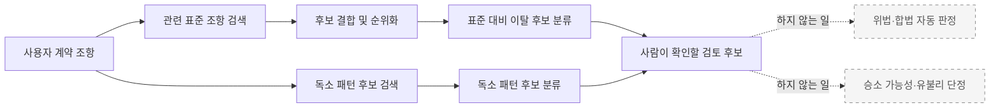
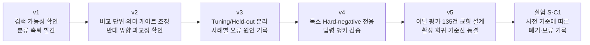
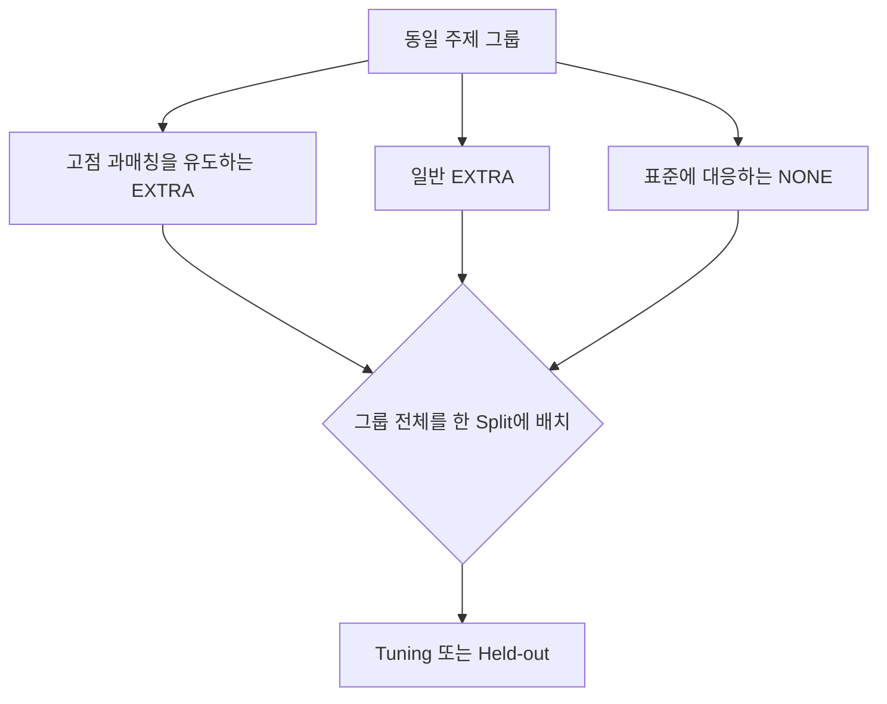
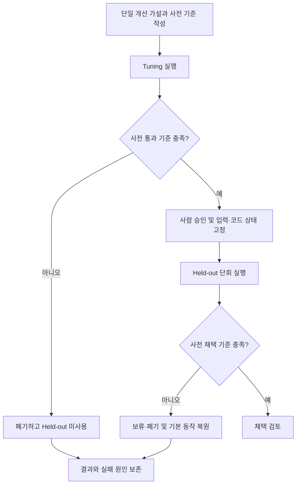

# WorkShield RAG 신뢰도 평가 개선 보고서

> **부제:** v1~v5 평가 체계의 변화와 현재 동결 기준선에 대한 근거  
> **작성 기준일:** 2026-07-13  
> **대상:** 제품 관계자, 기획자, 도메인 전문가, 개발자 및 평가 결과를 검토하는 비개발자  
> **평가 범위:** 관련 표준 조항 검색, 표준 대비 이탈 검토 후보 탐지, 사전 정의된 독소 패턴 검토 후보 탐지

---

## 1. 요약

WorkShield의 1차 검토 시스템은 계약서 문구를 보고 위법·합법을 자동 판정하는 시스템이 아니다.
사용자 계약서와 관련된 표준 조항을 찾고, 표준과 다르거나 사전에 정의된 위험 패턴과 유사해
**사람이 한 번 더 확인할 필요가 있는 조항을 검토 후보로 제시하는 시스템**이다.

초기 평가인 v1에서는 관련 표준 조항을 찾는 검색 기능이 작동하고 있다는 신호를 확인했지만,
그 이후의 이탈·독소 분류가 사실상 모든 조항을 같은 답으로 처리하는 **축퇴**도 함께 발견했다.
예를 들어 실제 이탈을 모두 잡았다는 재현율 100%는 겉으로는 좋아 보이지만, 정상 조항까지 전부
이탈로 경고했다면 실용적인 성능이라고 할 수 없다. v1은 바로 이 문제를 수치로 드러낸 평가였다.

이후 평가 과정은 단순히 임계값을 움직여 점수를 높이는 방향으로 진행되지 않았다. 비교 단위를
조정하고, 정상 사례를 명시적으로 포함하고, 어려운 반례를 만들고, 학습·조정에 참고하는
`tuning` 데이터와 마지막에만 확인하는 `held-out` 데이터를 분리했다. 또한 점수뿐 아니라 각
오류가 검색 실패인지, 과도한 매칭인지, 점수가 기준보다 낮았는지까지 사례별로 기록했다.

현재 활성 기준선인 v5는 SI·SM·SW 계약유형별 45건, 총 135건으로 구성된다. 각 유형은 tuning
30건과 held-out 15건으로 나뉘며, 비슷한 주제의 사례가 양쪽에 흩어져 정답을 간접적으로
노출하지 않도록 주제 그룹 단위로 격리했다. 현재 기본 설정에서 이탈 검토 후보 탐지의 전체
정밀도는 `0.742`, 재현율은 `0.767`, F1은 `0.754`다.

이 수치는 WorkShield가 법률적으로 옳은 결론을 75.4% 확률로 내린다는 의미가 아니다. 미리 정한
135건의 평가 사례에서 **표준에 대응하지 않는 조항과 대응하는 조항을 구분하는 균형 성능**을
나타낸다. 또한 계약유형별로 실패 방향이 다르다. SI·SM에서는 정상 조항을 이탈로 경고하는
경향이 상대적으로 크고, SW에서는 표준에 없는 조항을 표준 조항과 연결해 놓치는 경향이 크다.
따라서 현재 결과는 완성 선언이 아니라, 개선 전후를 비교할 수 있는 동결 기준점이다.

이번 평가 이력에서 신뢰도를 뒷받침하는 가장 중요한 근거는 최고 점수 하나가 아니다.

- 좋지 않은 결과와 축퇴를 숨기지 않고 원인과 함께 보존했다.
- 검색, 이탈 탐지, 독소 탐지를 서로 다른 문제로 나누어 측정했다.
- 조정용 데이터와 독립 확인용 데이터를 분리했다.
- 결과를 본 뒤 성공 기준을 바꾸지 않고, 기준을 충족하지 못한 실험을 폐기하거나 보류했다.
- 현재 한계와 적용 범위를 명시하고, 법적 결론 대신 검토 후보만 제공한다.

따라서 현재 자료가 입증하는 것은 “시스템이 항상 맞는다”가 아니라, **무엇을 얼마나 잘 찾고,
어떤 상황에서 실패하는지를 반복 가능하고 결정론적인 방식으로 측정할 수 있게 되었다**는 점이다.

---

## 2. 시스템이 하는 일과 하지 않는 일

### 2.1 평가 대상 흐름

WorkShield의 평가를 이해하려면 다음 세 문제를 구분해야 한다.

1. **검색:** 관련 표준 조항을 후보 목록 안에 가져왔는가?
2. **이탈 탐지:** 사용자 조항이 표준에 대응하는지, 별도 검토가 필요한 추가 조항인지 구분했는가?
3. **독소 탐지:** 사전에 정의한 위험 패턴과 유사한 조항을 검토 후보로 찾았는가?

첫 번째 검색이 잘되어도 두 번째와 세 번째 분류가 자동으로 정확해지는 것은 아니다. 반대로 최종
분류가 틀렸더라도 그 원인이 검색 단계인지, 후보 순위화인지, 임계값인지 구분해야 올바른 개선안을
세울 수 있다. 이 보고서는 이 세 층을 섞지 않고 설명한다.

### 2.2 여기서 말하는 RAG 신뢰도

RAG는 일반적으로 외부 자료에서 관련 내용을 검색한 뒤 그 근거를 활용하는 구조를 뜻한다.
WorkShield 1차 시스템에서는 생성형 AI가 법률 결론을 만들어 내는 것이 아니라, 표준계약서와
독소 패턴 데이터에서 검토 후보를 결정론적으로 검색·매칭·분류한다.

따라서 이 보고서에서 신뢰도는 다음 질문에 답할 수 있는 정도를 의미한다.

- 정답 표준 조항을 후보 안에 얼마나 안정적으로 포함하는가?
- 필요한 검토 후보를 얼마나 놓치지 않는가?
- 정상 조항에 불필요한 경고를 얼마나 줄이는가?
- 실패했을 때 어느 단계에서 왜 실패했는지 추적할 수 있는가?
- 개선안이 보지 않은 데이터에서도 재현되는가?
- 결과와 한계를 제3자가 다시 확인할 수 있는 기록이 남아 있는가?

### 2.3 해석의 경계

평가의 `양성`은 “위법”이라는 뜻이 아니다. 이탈 양성은 표준과 대응하지 않는 조항 등 추가
검토 대상이라는 뜻이고, 독소 양성은 현재 정의된 위험 패턴과 유사하다는 뜻이다. 실제 법적
효력과 적용 법령은 계약 당사자의 지위, 거래 구조, 전체 문맥, 최신 법령과 판례 등에 따라 별도
검토가 필요하다.

---

## 3. 평가를 읽기 위한 핵심 용어

### 3.1 골든셋과 데이터 분리

| 용어 | 쉬운 설명 | 이 보고서에서의 역할 |
| --- | --- | --- |
| 골든셋 | 정답을 미리 붙여 둔 시험 문제 모음 | 시스템 예측과 사람이 정한 기대 결과를 비교한다. |
| Tuning | 개선안을 고를 때 참고하는 연습 문제 | 가설이 가능성이 있는지 먼저 확인한다. |
| Held-out | 개선 중에는 보지 않고 마지막에만 확인하는 시험 문제 | 연습 문제에만 맞춘 과적합을 막는다. |
| 기준선 | 개선 전 비교 기준으로 고정한 결과 | 새 변경이 실제로 나아졌는지 판단하는 출발점이다. |
| 회귀 | 변경 후 기존에 되던 기능이 나빠지는 현상 | 동결 기준선과 비교해 성능 훼손을 감시한다. |
| Hard negative | 위험 사례와 표현은 비슷하지만 정답은 음성인 어려운 반례 | 단어만 보고 성급하게 경고하는 문제를 드러낸다. |

### 3.2 네 가지 판정 결과

각 조항을 “검토 대상이다/아니다”로 나누면 결과는 네 칸으로 정리된다.

|  | 실제 검토 대상 | 실제 정상·비대상 |
| --- | ---: | ---: |
| **시스템이 검토 대상으로 예측** | TP: 올바르게 찾음 | FP: 불필요하게 경고함 |
| **시스템이 정상·비대상으로 예측** | FN: 놓침 | TN: 올바르게 통과시킴 |

예를 들어 TP가 많더라도 FP도 매우 많으면 사용자는 지나치게 많은 경고를 확인해야 한다. 반대로
FP를 줄이는 데만 집중하면 FN이 늘어 중요한 검토 후보를 놓칠 수 있다. 그래서 하나의 숫자만으로
성능을 판단하지 않는다.

### 3.3 주요 성능 지표

| 지표 | 의미 | 함께 확인해야 할 점 |
| --- | --- | --- |
| Recall@5 | 검색 결과 상위 5개 안에 정답 표준 조항이 포함된 비율 | 최종 1순위가 정답이라는 뜻은 아니다. |
| MRR | 정답이 검색 결과의 앞쪽에 나타나는 정도 | Recall@5와 함께 봐야 후보 포함 여부와 순위를 모두 알 수 있다. |
| 정밀도(Precision) | 시스템이 경고한 것 중 실제 검토 대상의 비율 | 높을수록 불필요한 경고가 적다. |
| 재현율(Recall) | 실제 검토 대상 중 시스템이 찾아낸 비율 | 높을수록 놓친 검토 후보가 적다. |
| 특이도(Specificity) | 실제 정상 사례를 정상으로 통과시킨 비율 | 모든 사례를 경고하는 축퇴를 발견하는 데 중요하다. |
| F1 | 정밀도와 재현율의 조화평균 | 두 지표의 균형을 요약하지만 오류의 종류까지 설명하지는 않는다. |

### 3.4 축퇴, 과매칭, 저매칭

- **축퇴:** 시스템이 거의 모든 사례를 같은 답으로 판정하는 상태다. 모두 경고하면 재현율만
  높아질 수 있고, 모두 정상으로 처리하면 특이도만 높아질 수 있다.
- **과매칭(OVER_MATCH):** 표준에 없는 조항을 관련 표준 조항과 지나치게 강하게 연결해 이탈을
  놓치는 현상이다.
- **저매칭(UNDER_MATCH):** 실제 표준에 대응하는 정상 조항의 점수가 낮아 이탈로 잘못 경고하는
  현상이다.
- **임계값:** 점수가 어느 수준 이상일 때 두 문장을 대응한다고 볼지 정하는 기준이다. 임계값만
  바꾸면 한쪽 오류가 줄면서 다른 쪽 오류가 늘 수 있다.

---

## 4. 평가 체계의 전체 변화

v1부터 v5까지는 동일한 시험지를 반복한 순수한 모델 버전 비교가 아니다. 버전마다 평가 데이터의
규모, 정답 정의, 목적이 달라졌다. 따라서 아래 흐름은 단순 점수 상승표가 아니라 **어떤 약점을
발견했고 다음 평가가 그것을 어떻게 측정 가능하게 만들었는지**를 나타낸다.

| 단계 | 평가 규모·목적 | 발견 또는 개선 | 비교 시 주의점 |
| --- | --- | --- | --- |
| v1 | 92건, 초기 검색·이탈·독소 평가 | 검색은 작동했지만 분류 축퇴와 데이터 정의 문제 발견 | 문서 안에 초기 실행과 후속 재실행 기록이 함께 있다. |
| v2 | 98건, 비교 단위와 임계값 조정 관찰 | 이탈 판정이 한 방향에서 반대 방향으로 과교정될 수 있음을 확인 | 서로 다른 설정의 결과 파일을 단일 공식 추세로 합치면 안 된다. |
| v3 | 117건, 유형별 평가와 오류 진단 | 이탈 오류가 측정 가능한 수준에 도달하고 독소의 극성 혼동을 확인 | v1·v2와 데이터 구성이 같지 않다. |
| v4 | 54건, 독소 hard-negative challenge | 어려운 반례, 법령 앵커, 독립 held-out 도입 | 이탈 성능 비교용 데이터가 아니다. |
| v5 | 135건, 이탈 탐지 활성 기준선 | 유형별 균형, 주제 그룹 격리, 동결 held-out 확립 | 독소 임계값 채택용 데이터가 아니다. |
| 실험 S/C1 | 단일 가설 실험 | 실패·부작용을 사전 기준대로 폐기·보류 | 채택되지 않은 결과이며 현재 기본 동작에 포함되지 않는다. |

---

## 5. v1: 높은 재현율 뒤에 숨은 축퇴 발견

### 5.1 초기 평가의 의미

v1의 가장 큰 성과는 높은 점수를 얻은 것이 아니라 **겉보기 좋은 점수가 실제 능력을 의미하지
않을 수 있다는 사실을 드러낸 것**이다. 초기 리뷰에서는 검색 단계가 관련 표준 조항을 상위
후보에 포함하고, 재정렬이 순위를 개선하는 신호를 관찰했다. 반면 이탈·독소 분류는 모든 사례를
양성으로 처리하는 축퇴를 보였다.

모든 사례를 이탈이라고 답하면 실제 이탈을 하나도 놓치지 않으므로 재현율은 100%가 될 수 있다.
하지만 정상 조항도 전부 경고하므로 특이도는 0%가 된다. 사용자는 모든 조항에 붙은 경고를 다시
검토해야 하므로 우선순위를 얻을 수 없다. v1부터 재현율뿐 아니라 특이도와 혼동행렬을 함께 본
이유가 여기에 있다.

현재 보존된 v1 재실행 결과의 검색 성능은 다음과 같다.

| 검색 방식 | Recall@5 | MRR |
| --- | ---: | ---: |
| BM25 | 0.884 | 0.804 |
| Dense | 0.930 | 0.844 |
| Hybrid | 0.930 | 0.829 |
| Hybrid + rerank | 0.942 | 0.874 |

이 결과는 검색 후보를 결합하고 다시 순위를 정하는 방식이 당시 데이터에서 정답 포함률과 순위를
개선했다는 근거다. 다만 v1 리뷰에는 더 이른 실행의 수치도 함께 보존되어 있으므로, 위 표는
현재 `v1_result.md`에 남아 있는 2026-07-02 재실행 결과를 기준으로 했다.

### 5.2 이탈 판정의 구조적 문제

초기 이탈 판정은 짧은 사용자 문장과 여러 항으로 구성된 긴 표준 조항 전체의 글자 일치율을
비교했다. 내용이 같은 문장도 길이와 형식이 크게 다르면 일치율이 낮아질 수밖에 없었다. 실제
v1 분석에서 `NONE`, 즉 표준과 대응한다고 정답을 붙인 사례도 기존 기준값 `0.85`를 넘지 못했다.

이 문제에 대응해 다음 변화가 이루어졌다.

- 조 전체를 한 번에 비교하는 대신 항·호 단위의 더 작은 조각을 비교했다.
- 의미상 커버되는지를 확인하는 게이트를 실제 평가와 실행 경로에 연결했다.
- 부정어, 숫자, 당사자처럼 법적 의미를 크게 바꿀 수 있는 표현은 별도로 탐지했다.
- 모든 사례가 하나의 판정으로 몰리는 경우 축퇴 경보를 내도록 했다.

### 5.3 독소 판정의 무신호 임계값 문제

독소 후보의 점수는 내부적으로 `0.5`가 “관련성이 확인되지 않은 중립적인 바닥값”이 될 수 있었다.
그런데 당시 임계값도 `0.5`였고 `점수 >= 임계값` 조건을 사용했기 때문에 무신호 후보까지 모두
통과했다. 점수가 실제로 높아서가 아니라, **아무 신호가 없는 값과 통과 기준이 겹쳤기 때문**이다.

중복 패턴 제거, 독소 후보 수 분리, 임계값 조정으로 모든 조항에 독소 패턴을 붙이는 축퇴는
완화되었다. 그러나 임계값을 높이면 불필요한 경고가 줄어드는 대신 실제 독소 후보를 놓치는
문제가 커졌다. 이는 이후 평가가 정밀도와 재현율을 반드시 함께 보게 된 계기다.

### 5.4 v1이 남긴 평가 자산

v1 골든셋은 작고 정답 정의에 모호함이 있었지만 다음의 중요한 기반을 만들었다.

- 정상 사례를 포함해 특이도를 측정할 수 있게 했다.
- 말바꿈, 반대 의미, 부분 변경 같은 함정 유형을 기록했다.
- 검색 정답, 이탈 정답, 독소 정답을 한 사례에서 함께 평가했다.
- SI·SM·SW 세 계약유형의 차이를 확인하기 시작했다.
- 점수가 아니라 평가 데이터와 비교 단위 자체도 검토 대상임을 보여 주었다.

---

## 6. v2: 과교정과 임계값의 한계 확인

v2에서는 조항 비교 방식과 임계값을 바꾼 여러 결과가 남아 있다. 이 결과들은 동일 설정의
연속적인 공식 버전이라기보다, 어느 방향으로 조정할 때 어떤 부작용이 나타나는지를 보여 주는
진단 기록으로 해석해야 한다.

| 결과 | SI 이탈 F1 | SM 이탈 F1 | SW 이탈 F1 | 주된 관찰 |
| --- | ---: | ---: | ---: | --- |
| 기능 개선 직후 | 0.316 | 0.000 | 0.125 | 많은 이탈을 정상으로 처리하는 과교정과 SI 독소 전부 음성 축퇴 |
| 별도 임계값 설정 결과 | 0.737 | 0.667 | 0.848 | 이탈 재현율은 높지만 특이도가 각각 0.091, 0.154, 0.286으로 낮음 |

두 결과를 함께 보면 임계값을 한쪽으로 움직여 재현율을 높일 수는 있지만 정상 조항에 대한
오경고가 크게 늘 수 있음을 알 수 있다. 반대로 오경고를 줄이면 실제 검토 후보를 대부분 놓칠
수 있다. 이 단계에서 얻은 핵심 결론은 다음과 같다.

1. 하나의 전체 점수만 최적화하면 반대 방향 오류를 가릴 수 있다.
2. 짧은 문장과 긴 조항을 섞은 평가 데이터로 의미 커버리지 임계값을 공정하게 조정하기 어렵다.
3. 임계값을 평가 데이터에서 가장 좋은 값으로 자동 선택하면 그 데이터에만 맞춘 과적합이 생긴다.
4. 임계값 후보를 보는 데이터와 최종 확인 데이터를 분리해야 한다.

이 결론은 v3부터 tuning/held-out 분리와 임계값 자동 채택 금지 원칙으로 이어졌다.

---

## 7. v3: 총점에서 사례별 오류 분석으로

### 7.1 검색과 이탈 성능

v3는 전체 117건으로 확대되었고, 결과를 tuning과 held-out으로 나누어 기록했다. 검색에서는
hybrid 5:5와 7:3이 Recall@5 `0.920`을 기록했고, 최고 MRR은 `0.903`이었다.

기본 임계값에서 이탈 탐지의 전체 혼동행렬은 TP 30, FP 7, FN 12, TN 68이다. 이를 요약하면
정밀도 `0.811`, 재현율 `0.714`, 특이도 `0.907`, F1 `0.759`다. v1의 단일 판정 축퇴를 벗어나
정상과 이탈이 모두 실제 판정 결과에 나타났고, 사례별 실패 원인을 분석할 수 있게 되었다.

| 계약유형 | 정밀도 | 재현율 | 특이도 | F1 |
| --- | ---: | ---: | ---: | ---: |
| SI | 0.750 | 0.600 | 0.900 | 0.667 |
| SM | 0.750 | 0.800 | 0.867 | 0.774 |
| SW | 1.000 | 0.750 | 1.000 | 0.857 |

다만 이 수치를 v5와 직접 연결해 “성능이 내려갔다” 또는 “올라갔다”고 결론 내리면 안 된다.
v3와 v5의 데이터 구성과 양성·음성 비율, 함정 설계가 서로 다르기 때문이다.

### 7.2 최종 판정과 진단 기록의 일치

초기 진단에서는 최종 판정과 별도로 후보를 다시 검색해, 진단에 표시된 후보와 실제 판정에 사용된
후보가 다른 사례가 있었다. v3에서는 실제 검토 실행 중의 재정렬 결과를 그대로 보존하도록 바꾸어,
최종 매칭 표준이 진단의 top-3 후보 또는 서브청크 부모에 없는 사례가 0건이 되었다.

이 변화는 점수를 직접 높이는 기능은 아니지만 신뢰도 측면에서 중요하다. 오류를 분석할 때 보는
근거가 실제 판정 당시의 근거와 같아야 “왜 틀렸는가”를 재현할 수 있기 때문이다.

### 7.3 독소 탐지에서 발견한 의미 반전 문제

v3 독소 탐지의 전체 결과는 TP 8, FP 31, FN 10, TN 68로 F1 `0.281`이었다. 사례별 진단에서는
단순히 단어가 부족한 문제보다 더 구체적인 실패가 발견되었다.

| 혼동한 표현 | 시스템이 구분해야 했던 차이 |
| --- | --- |
| 추가작업 대금 지급 보장 ↔ 무상 추가작업 | 같은 주제 안에서 대가 지급 여부 |
| 종료 후 1년 비밀유지 ↔ 영구 비밀유지 | 기간이 제한되어 있는지 여부 |
| 지식재산권 공동소유 ↔ 전부·무상 귀속 | 권리 범위와 소유 주체 |
| 상호 합의에 따른 해석 ↔ 일방 당사자의 해석 | 권한을 가진 당사자와 합의 여부 |
| 실손해 범위 배상 ↔ 정액·과도한 위약벌 | 손해 산정 방식과 상한 |

일부 잘못된 독소 후보는 점수가 `0.90`을 넘었고, 일부 실제 독소 후보는 정답 패턴이 검색되어도
점수가 `0.032` 이하로 나타났다. 따라서 임계값만 높이거나 낮추는 방식으로 두 문제를 동시에
해결하기 어려웠다. 이에 따라 v4에서는 표현이 매우 비슷하지만 정답은 반대인 hard-negative를
독립적으로 설계했다.

---

## 8. v4: 독소 탐지를 위한 어려운 반례 평가

### 8.1 v4의 목적

v4는 전체 시스템의 종합 성능 시험이 아니라 **독소 패턴 탐지의 hard-negative challenge
set**이다. 전체 54건으로, 계약유형별 18건씩 균등하게 구성했고 tuning 36건과 held-out 18건으로
분리했다.

양성과 음성을 비슷한 주제의 쌍으로 만들었다. 예를 들어 “추가작업”이라는 같은 단어를 사용하되,
한 사례는 추가 대금을 배제하고 다른 사례는 추가 대금을 보장하도록 설계했다. 이 방식은 단순한
핵심 단어 탐색이 아니라 부정, 당사자, 기간, 대가, 권한의 차이를 구분하는지 시험한다.

v4의 SI와 SW에는 이탈 양성 사례가 없고 EXTRA 사례 6건도 모두 SM에 있다. 따라서 v4의 SI·SW
이탈 정밀도·재현율·F1을 다른 버전의 이탈 성능과 비교해서는 안 된다.

### 8.2 법령 앵커의 역할

v4는 추가 대가, 일방적 변경·해지, 지식재산권, 비밀유지, 손해배상, 분쟁 해결 등 여섯 주제에
대해 법령 앵커를 마련했다. 법령 식별자와 시행 버전을 다시 조회하고, 11개 인용을 검증해 성공
11건, 오류 0건, 확인 필요 0건으로 기록했다.

다만 법령 앵커는 독소 라벨을 기계적으로 만드는 규칙이 아니다. 하도급법은 적용 요건을 별도로
검토해야 하고, 특허법의 공유 규정은 특허권에 한정되며, 영업비밀 관련 법령도 해당 정보가 실제
영업비밀 요건을 충족하는지 확인해야 한다. 이 제한을 명시함으로써 법률 근거를 과도하게 일반화하지
않도록 했다.

### 8.3 결과와 해석

기본 독소 임계값 `0.60`에서 v4 전체 결과는 다음과 같다.

| 범위 | 정밀도 | 재현율 | 특이도 | F1 | TP | FP | FN | TN |
| --- | ---: | ---: | ---: | ---: | ---: | ---: | ---: | ---: |
| 전체 54건 | 0.688 | 0.407 | 0.815 | 0.512 | 11 | 5 | 16 | 22 |
| Held-out 18건 | 1.000 | 0.222 | 1.000 | 0.364 | 2 | 0 | 7 | 9 |

held-out에서는 경고한 두 사례가 모두 정답이어서 정밀도는 높았지만, 실제 검토 대상 9건 중 7건을
놓쳐 재현율이 낮았다. 이 결과는 “독소 탐지가 개선되었다”는 결론보다, **현재 설정이 어려운
반례에서 매우 보수적으로 작동하며 누락이 크다**는 근거로 사용해야 한다.

---

## 9. v5: 현재 활성 이탈 평가 기준선

### 9.1 평가 설계

v5는 v4에서 이탈 양성 분포가 불균형했던 문제를 보완하기 위해 별도의 이탈 평가 트랙으로
설계되었다.

| 계약유형 | Tuning | Held-out | 합계 |
| --- | ---: | ---: | ---: |
| SI | 30 | 15 | 45 |
| SM | 30 | 15 | 45 |
| SW | 30 | 15 | 45 |
| **합계** | **90** | **45** | **135** |

각 계약유형의 tuning에는 이탈 양성 20건과 표준 대응 음성 10건, held-out에는 이탈 양성 10건과
표준 대응 음성 5건이 있다. 따라서 세 계약유형 모두에서 TP·FP·FN·TN과 정밀도·재현율·F1을
계산할 수 있다.

한 주제 그룹은 다음 세 사례로 구성된다.

같은 핵심 명사, 숫자·기간 변형, 동일 표준 조항을 공유하는 사례를 한 그룹으로 묶고 그룹 전체를
tuning 또는 held-out 한쪽에만 배치했다. 이는 연습 문제에서 본 표현이 시험 문제에 거의 그대로
나타나는 정보 누출을 줄이기 위한 설계다.

### 9.2 현재 기본 설정

v5 결과를 관찰한 뒤 가장 높은 점수를 보인 값을 자동 채택하지 않았다. 현재 프로덕션 기본값은
다음과 같이 유지한다.

| 항목 | 기본값 | 유지 이유 |
| --- | ---: | --- |
| 이탈 `match_threshold` | 0.50 | v5에서 0.55 후보가 더 높은 F1을 보였지만 동일 데이터 관찰만으로 변경하지 않는다. |
| 독소 `toxic_threshold` | 0.60 | v5는 독소 임계값 채택용 데이터가 아니며 v4의 독립 목적을 대체하지 않는다. |

### 9.3 이탈 탐지 기준선 결과

| 계약유형 | 정밀도 | 재현율 | 특이도 | F1 | TP | FP | FN | TN |
| --- | ---: | ---: | ---: | ---: | ---: | ---: | ---: | ---: |
| SI | 0.700 | 0.933 | 0.200 | 0.800 | 28 | 12 | 2 | 3 |
| SM | 0.735 | 0.833 | 0.400 | 0.781 | 25 | 9 | 5 | 6 |
| SW | 0.842 | 0.533 | 0.800 | 0.653 | 16 | 3 | 14 | 12 |
| **전체** | **0.742** | **0.767** | **0.467** | **0.754** | **69** | **24** | **21** | **21** |

결과는 계약유형에 따라 서로 다른 실패 방향을 보여 준다.

- **SI:** 실제 이탈 30건 중 28건을 찾았지만 정상 15건 중 12건을 이탈로 경고했다. 놓침은 적지만
  불필요한 경고가 많다.
- **SM:** SI보다 오경고는 적지만 저매칭 FP 9건과 과매칭 FN 5건이 함께 남아 있다.
- **SW:** 경고한 사례의 정확성은 상대적으로 높지만 실제 이탈 30건 중 14건을 놓쳤다. 표준에 없는
  조항을 관련 표준 조항과 강하게 연결하는 과매칭이 주된 문제다.

이처럼 SI·SM의 저매칭과 SW의 과매칭은 서로 반대 방향의 오류다. 하나의 전역 임계값을 올리거나
내리는 방식으로 세 유형을 동시에 해결할 근거는 없다. 후속 개선은 오류 메커니즘 하나를 먼저
정하고 별도의 가설로 검증해야 한다.

### 9.4 검색 성능

v5에서 검색 정답 `gold_clause_id`가 있는 45건을 대상으로 한 결과는 다음과 같다.

| 검색 방식 | Recall@5 | MRR |
| --- | ---: | ---: |
| BM25 | 0.956 | 0.806 |
| Dense | 1.000 | 0.896 |
| Hybrid 7:3 | 1.000 | 0.916 |
| Hybrid 7:3 + rerank | 0.933 | 0.859 |

Dense와 hybrid 7:3은 모든 정답을 상위 5개 안에 포함했고, hybrid 7:3의 MRR이 가장 높았다.
반면 모든 hybrid+rereank 변형의 Recall@5는 `0.933`으로 낮아졌다. 이는 재정렬이 항상 검색 품질을
높인다는 가정을 지지하지 않는다.

또한 검색 지표의 분모는 전체 135건이 아니라 정답 표준 조항이 있는 45건이다. 표준에 없는
EXTRA 사례는 검색 정답 집계에 포함되지 않으므로, Recall@5 `1.000`을 전체 이탈 분류의 완전한
성능으로 해석해서는 안 된다.

### 9.5 독소 탐지 관찰

v5의 기본 독소 임계값 `0.60` 전체 결과는 정밀도 `0.708`, 재현율 `0.586`, 특이도 `0.934`,
F1 `0.642`다. 유형별 F1은 SI `0.750`, SM `0.462`, SW `0.667`이다.

SM에는 검색 실패와 임계값 미달로 인한 FN이 남아 있고, SW에는 다른 독소 패턴으로 잘못 연결한
FP가 남아 있다. 다만 v5는 이탈 평가를 위해 설계되었으므로 이 수치만으로 독소 패턴 데이터나
임계값을 변경하지 않는다. 독소 개선의 주 평가 자료는 v4 hard-negative 절차다.

---

## 10. 실패한 실험이 보여 주는 평가 거버넌스

좋은 결과만 남기면 시스템의 실제 신뢰도를 판단하기 어렵다. WorkShield 평가 기록에는 통과하지
못한 실험도 가설, 통과 기준, 결과와 함께 보존되어 있다.

### 10.1 실험 절차

이 절차의 목적은 결과를 본 뒤 가설이나 성공 기준을 바꾸는 일을 막고, held-out을 반복해서 보며
그 시험 문제에 맞추는 것을 방지하는 데 있다.

### 10.2 실험 S: tuning 단계에서 폐기

실험 S는 독소 검색 후보의 제목 접두 정보를 활용하는 단일 가설을 시험했다.

| 구분 | TP | FP | FN | TN | F1 |
| --- | ---: | ---: | ---: | ---: | ---: |
| 기준선 | 9 | 5 | 9 | 13 | 0.563 |
| 후보 | 6 | 2 | 12 | 16 | 0.462 |

후보는 FP를 줄였지만 FN이 9건에서 12건으로 늘었고 F1도 낮아졌다. 사전에 정한 FN 7건 이하와
F1 `0.563` 초과 기준을 모두 충족하지 못했다. 따라서 held-out을 열지 않고 실험을 폐기했다.
독립 시험 데이터를 소비하지 않았다는 점도 함께 기록했다.

### 10.3 실험 C1: 점수는 올랐지만 부작용으로 보류

C1은 SW 과매칭을 줄이기 위해 표준 조항 후보와 서브청크를 합친 부모 후보가 서로 다를 때 EXTRA
검토 후보로 처리하는 규칙을 시험했다.

| 단계 | 구분 | TP | FP | FN | TN | F1 |
| --- | --- | ---: | ---: | ---: | ---: | ---: |
| Tuning 30건 | 기준선 | 10 | 2 | 10 | 8 | 0.625 |
| Tuning 30건 | 후보 | 12 | 2 | 8 | 8 | 0.706 |
| Held-out 15건 | 기준선 | 6 | 1 | 4 | 4 | 0.706 |
| Held-out 15건 | 후보 | 8 | 2 | 2 | 3 | 0.800 |

후보는 tuning과 held-out 모두에서 F1이 높아졌고 held-out FN도 4건에서 2건으로 줄였다. 그러나
FP가 1건에서 2건으로 증가해 사전에 정한 채택 기준을 충족하지 못했다. 전체 점수만 보면 채택하고
싶을 수 있지만, 정상 조항에 대한 오경고 증가를 허용하지 않는 기준에 따라 보류했고 기본 런타임
동작에서 제거했다.

이 사례는 다음의 중요한 신뢰 근거를 제공한다.

- 결과가 좋아 보여도 사전 기준을 사후에 완화하지 않았다.
- held-out 결과를 본 뒤 같은 데이터로 규칙을 다시 조정하지 않았다.
- 실패 또는 보류 결과를 삭제하지 않고 재현 자료와 함께 남겼다.
- 다음 시도는 새 가설과 새 독립 held-out으로 분리하도록 제한했다.

---

## 11. 현재 확보된 신뢰 근거

### 11.1 측정 근거

- 검색, 이탈, 독소를 분리해 평가한다.
- 정밀도·재현율뿐 아니라 특이도와 TP·FP·FN·TN을 함께 기록한다.
- 모든 판정이 같은 값으로 몰리는 축퇴를 명시적으로 경고한다.
- 최종 점수 아래의 사례별 오류 원인을 `OVER_MATCH`, `UNDER_MATCH`, `SEARCH_MISS`,
  `BELOW_THRESHOLD`, `WRONG_PATTERN` 등으로 기록한다.

### 11.2 데이터 근거

- 정상 사례를 포함해 불필요한 경고를 측정한다.
- 부정, 숫자, 당사자, 기간, 순서 변경, 말바꿈 등 다양한 함정을 포함한다.
- v4에서는 위험 사례와 표현이 유사한 hard-negative를 쌍으로 구성했다.
- v5에서는 세 계약유형의 규모를 같게 하고, 각 유형에 이탈 양성과 음성을 모두 포함했다.
- 유사한 주제 그룹을 tuning과 held-out 사이에 나누지 않아 정보 누출 위험을 낮췄다.

### 11.3 절차 근거

- 평가는 LLM의 주관적 점수 대신 결정론적인 계산을 사용한다.
- 임계값 후보 중 같은 데이터에서 가장 높은 값을 자동 채택하지 않는다.
- held-out 실행 전 사람 승인과 입력·코드 식별자 일치를 확인한다.
- held-out 실행을 단회 기록하고 반복 관찰에 따른 과적합을 방지한다.
- v5를 활성 회귀 기준으로 동결하고 추가 튜닝이나 기존 held-out 재실행을 금지한다.

### 11.4 투명성 근거

- v1의 축퇴, v2의 과교정, v3 독소의 낮은 F1, v4 held-out의 낮은 재현율을 모두 보존했다.
- 목적이 다른 v4와 v5를 하나의 성능 추이로 합치지 않는다.
- 실험 S와 C1처럼 채택되지 않은 가설도 판정 근거와 함께 기록한다.
- 현재 기본값보다 높은 F1 후보가 관찰되어도 독립 검증과 승인 없이는 변경하지 않는다.

---

## 12. 제한사항과 올바른 사용 범위

### 12.1 버전 간 단순 비교의 제한

v1~v5는 표본 수, 정답 정의, 양성 비율, 문장 구조, 평가 목적이 서로 다르다. 따라서 각 버전의
F1을 하나의 선으로 연결해 “지속적으로 상승했다”거나 “특정 버전에서 하락했다”고 표현하는 것은
타당하지 않다. 비교 가능한 것은 같은 데이터와 같은 설정에서 실행한 기준선·후보 실험이다.

### 12.2 평가 데이터와 실제 계약서의 차이

골든셋은 특정 오류를 측정하기 위해 의도적으로 구성한 사례다. 실제 계약서는 더 길고, 여러 주제가
한 조항에 섞이고, 문서 형식과 작성 관행도 다양하다. 현재 결과는 설계된 평가 범위의 성능이며,
모든 실제 계약서 분포를 대표한다는 통계적 보장은 아니다.

### 12.3 검색 성능과 최종 신뢰도의 차이

Recall@5가 높다는 것은 관련 표준 조항이 후보 안에 있다는 뜻이다. 올바른 최종 판정, 독소 패턴
식별, 법적 타당성까지 보장하지 않는다. 특히 표준에 없는 EXTRA 사례는 검색 정답 지표의 분모에서
제외될 수 있으므로 검색 수치만으로 이탈 탐지 품질을 설명할 수 없다.

### 12.4 계약유형별 실패 방향

현재 v5 기준선에서는 SI·SM의 저매칭과 SW의 과매칭이 동시에 존재한다. 하나의 공통 임계값을
조정하면 특정 유형은 좋아지고 다른 유형은 나빠질 수 있다. 유형별 규칙을 즉시 추가하는 것도
과적합 위험이 있으므로 새 독립 데이터와 사전 가설이 필요하다.

### 12.5 독소 탐지의 한계

독소 탐지는 같은 주제 안의 부정, 당사자 역할, 기간, 대가, 권한 차이를 혼동할 수 있다. v4
held-out에서는 불필요한 경고는 없었지만 실제 검토 대상 9건 중 7건을 놓쳤다. 일부 유형에서는
다른 패턴으로 잘못 연결하는 문제도 남아 있다.

### 12.6 법률 판단과의 거리

표준계약서와 다르거나 독소 패턴과 유사하다는 사실만으로 위법, 무효, 불리함 또는 분쟁 결과를
단정할 수 없다. WorkShield 1차 결과는 전문가 또는 담당자가 우선 확인할 후보를 좁히는 데
사용해야 하며, 최종 법률 판단을 대신해서는 안 된다.

---

## 13. 향후 평가 원칙과 권고

현재 v5는 추가 튜닝 대상이 아니라 활성 회귀 기준이다. 후속 평가를 시작하려면 기존 원칙에 따라
새 독립 데이터, 하나의 명확한 가설, 사전 승인, 독립 held-out이 필요하다.

우선순위 후보는 다음과 같지만 한 실험에서 동시에 다루지 않는다.

1. **SW 과매칭:** 표준에 없는 조항이 높은 점수로 표준과 연결되는 한 가지 메커니즘을 선정한다.
2. **SI·SM 저매칭:** 정상적인 표준 대응 조항이 낮은 점수를 받는 원인을 별도 가설로 검증한다.
3. **독소 극성 구분:** 같은 주제 안에서 부정, 당사자, 기간 또는 대가가 반대인 한 유형을 선택한다.
4. **실계약 문서 평가:** 기존 골든과 분리된 독립 데이터로 문서 파싱부터 후보 제시까지의 전체
   흐름을 평가하되, 현재 v5 기준선과 같은 숫자로 직접 비교하지 않는다.

각 실험은 다음 내용을 사전에 명시해야 한다.

- 바꾸려는 오류 메커니즘 하나
- 변경 전 기준선과 입력 데이터 해시
- tuning 통과 기준과 held-out 채택 기준
- 허용할 수 없는 부작용 지표
- held-out을 열 수 있는 승인 조건
- 실패했을 때 결과를 보존하고 기본 동작을 복원하는 절차

---

## 14. 결론

WorkShield의 평가 이력은 처음부터 높은 성능을 입증한 기록이 아니다. 초기에는 모든 사례를 같은
답으로 처리하는 축퇴, 비교 단위 불일치, 무신호 점수와 임계값의 충돌이 있었다. 이후 정상 사례와
어려운 반례를 추가하고, tuning과 held-out을 분리하고, 오류 원인을 사례별로 기록하면서 평가
체계 자체를 개선했다.

현재 v5는 세 계약유형에서 이탈 검토 후보 성능을 비교할 수 있는 135건의 동결 기준선을 제공한다.
전체 이탈 F1은 `0.754`지만 유형별 실패 방향이 다르며, 특히 SW 과매칭과 SI·SM 저매칭이 남아
있다. v4 독소 challenge는 어려운 반례에서 누락이 크다는 별도의 한계를 보여 준다.

그럼에도 현재 평가 체계는 초기보다 다음 질문에 훨씬 명확하게 답할 수 있다.

- 어떤 기능을 평가했는가?
- 어떤 데이터에서 평가했는가?
- 무엇을 맞히고 무엇을 놓쳤는가?
- 결과가 조정용 데이터에만 맞은 것은 아닌가?
- 개선안이 다른 오류를 늘리지는 않았는가?
- 결과를 법률 판단으로 어디까지 해석할 수 있는가?

따라서 이 보고서가 제공하는 신뢰의 근거는 “오류가 없다”는 주장이 아니다. **오류를 숨기지 않고
측정하며, 독립 검증과 사전 기준으로 변경을 통제하고, 현재 가능한 것과 불가능한 것을 명확히
구분한다는 것**이다. 이는 RAG 기반 검토 지원 시스템을 안전하고 점진적으로 개선하기 위한
필수 조건이다.

---

## 부록 A. 버전별 핵심 자료

| 구분 | 주요 문서 | 용도 |
| --- | --- | --- |
| v1 | [v1 결과](../archive/evaluation/track-a/v1_result.md), [v1 리뷰](../archive/evaluation/track-a/v1_review.md) | 초기 검색 성능, 축퇴와 데이터 한계 분석 |
| v2 | [v2 기능 개선 결과](../archive/evaluation/track-a/v2_after_feature_improvement_result.md), [v2 임계값 결과](../archive/evaluation/track-a/v2_result_toxic_0.53_coverage_0.65.md) | 과교정과 임계값 trade-off 확인 |
| v3 | [v3 결과](../archive/evaluation/track-a/v3_result.md), [v3 진단 리뷰](../archive/evaluation/track-a/v3_diagnostics_review.md) | 유형별 결과, trace 정합성, 오류 메커니즘 분석 |
| v4 | [v4 설계](../archive/evaluation/track-a/v4_design.md), [v4 결과](../archive/evaluation/track-a/v4_result.md), [법령 앵커](../archive/evaluation/track-a/v4_legal_anchors.md), [법령 증적](../archive/evaluation/track-a/v4_legal_anchors_evidence.md) | 독소 hard-negative와 법령 앵커 검증 |
| v5 | [v5 결과](v5_result.md), [v5 리뷰](v5_review.md), [동결 기준선](baseline-v5.md) | 현재 활성 이탈 기준선과 적용 범위 |
| 실험 S | [실험 S 판정](experiments/S/README.md), [tuning 결과](experiments/S/tuning-result.md) | tuning 실패 후 held-out 미사용 사례 |
| 실험 C1 | [실험 C1 판정](experiments/C/README.md), [tuning 결과](experiments/C/tuning-result.md), [held-out 결과](experiments/C/heldout-result.md) | 점수 향상에도 부작용 기준으로 보류한 사례 |

## 부록 B. 주장과 증거의 대응

| 보고서의 핵심 주장 | 확인 자료 |
| --- | --- |
| v1에서 분류 축퇴와 비교 단위 문제가 발견되었다. | `v1_review.md`의 1~3장과 8장 |
| v2에서 반대 방향 과교정과 임계값 trade-off가 관찰되었다. | 두 v2 결과 파일의 계약유형별 혼동행렬 |
| v3에서 최종 판정과 진단 trace 불일치가 제거되었다. | `v3_diagnostics_review.md` 1장 |
| v3 독소 오류는 단순 임계값 조정으로 해결하기 어렵다. | `v3_diagnostics_review.md` 3~4장 |
| v4는 독소 hard-negative 전용이며 이탈 비교용이 아니다. | `v4_design.md` 상단 경고와 1장 |
| v4 법령 인용 11건을 재검증했다. | `v4_design.md` 변경 이력과 `v4_legal_anchors_evidence.md` |
| v5는 135건의 활성 이탈 기준선이다. | `v5_review.md`, `baseline-v5.md` |
| v5의 유형별 실패 방향이 서로 다르다. | `v5_review.md` 3장, `v5_diagnostics.md` |
| 실험 S는 tuning 실패로 held-out을 열지 않았다. | `experiments/S/README.md` |
| C1은 F1이 올랐지만 FP 증가로 보류했다. | `experiments/C/README.md`, `heldout-result.md` |

## 부록 C. 보고서 수치를 읽는 예시

v5 SI 이탈 결과는 TP 28, FP 12, FN 2, TN 3이다.

- 실제 이탈 30건 중 28건을 찾았으므로 재현율은 `28 / (28 + 2) = 0.933`이다.
- 이탈이라고 경고한 40건 중 28건이 정답이므로 정밀도는 `28 / (28 + 12) = 0.700`이다.
- 실제 정상 15건 중 3건만 정상으로 통과했으므로 특이도는 `3 / (3 + 12) = 0.200`이다.

재현율만 보면 매우 좋아 보이지만 특이도까지 보면 정상 사례에 대한 경고가 많다는 사실을 알 수
있다. 이것이 본 보고서에서 하나의 점수 대신 혼동행렬과 여러 지표를 함께 제시하는 이유다.
